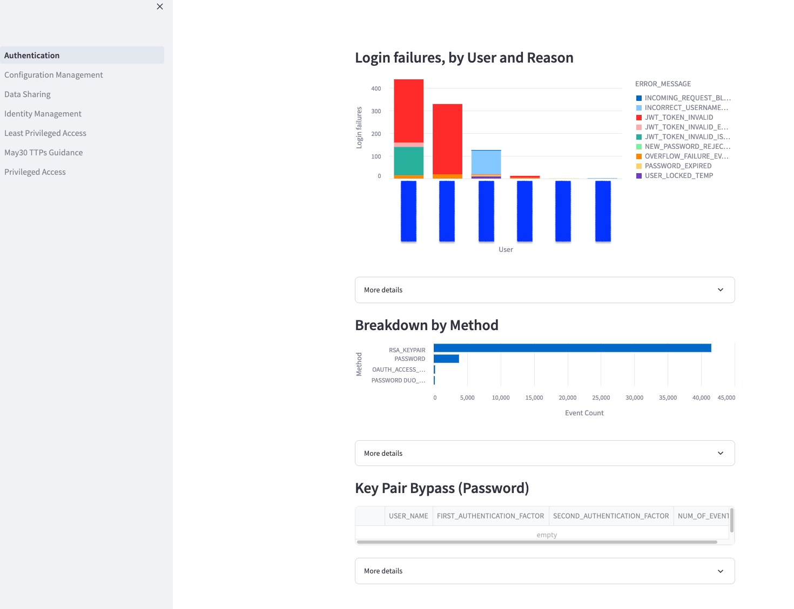

This is a repository containing the Streamlit version of the [Snowflake
security dashboards][1].

# About

This project is first and foremost a set of tools aimed to help with step #2 of
CIRP incident response, **identification**. It is not meant to be a complete
end-to-end solution, but rather a reference implementation that needs to be
adapted to the company's needs.

This project contains a set of queries with reference information that explains
what kind of information those queries provide.

The provided tools can be used individually through stored procedures.
Alternatively, the project contains a Streamlit in Snowflake UI that can be
deployed as:

- a Streamlit application
- Snowflake native application
- docker image
- stored procedures

Alternatively the queries are kept as `.sql` files in a [dedicated directory][4]
with accompanying README files.

Additional information, including installation and upgrade instructions is
available on the [Sentry documentation website][doc].

[1]:
https://quickstarts.snowflake.com/guide/security_dashboards_for_snowflake/index.html

[4]: ./src/queries

[doc]: https://snowflake-labs.github.io/Sentry
