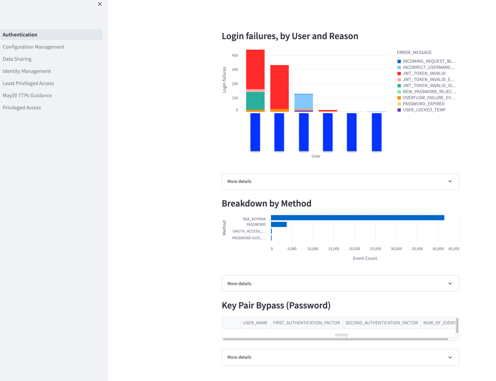

# Introduction

This project is first and foremost a set of tools aimed to help with step #2 of
CIRP incident response, **identification**. It is not meant to be a complete
end-to-end solution, but rather a reference implementation that needs to be
adapted to the company's needs.

Effectively it is a set of queries from [Snowflake Security
Dashboards][quickstart] wrapped in a Streamlit application. The individual
queries are kept as `.sql` files and can be used without installing the whole
application.

<!-- TODO:
theme dependant screenshots after
https://github.com/rust-lang/mdBook/pull/1991
is merged -->

The Streamlit UI can be deployed as:

- Streamlit application: locally and in Snowflake
- Snowflake native application
- Docker container

Sentry can also be deployed as a [Trust Center extension][tc-ext]. This
registers Sentry's security scanners directly with the [Snowflake Trust
Center][tc-doc], allowing findings to appear alongside built-in scanner packages
in Snowsight's Governance & Security section. This deployment model does not
require the Streamlit UI -- the scanners run on a schedule managed by Trust
Center and results are queryable through the `SNOWFLAKE.TRUST_CENTER.FINDINGS`
view.

See corresponding section for installation instructions. The easiest method to
install Sentry is probably ["Streamlit in Snowflake through a GitHub
action"][ez-button].

[tc-ext]: ./guide/installation/trust-center-extension.md
[tc-doc]: https://docs.snowflake.com/en/user-guide/trust-center/trust-center-extensions

[quickstart]: https://quickstarts.snowflake.com/guide/security_dashboards_for_snowflake/index.html
[ez-button]: ./guide/installation/streamlit-in-snowflake.md#github-action
